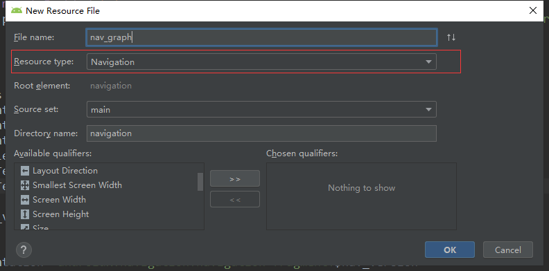

# NavigationTest
[Navigation](https://developer.android.google.cn/guide/navigation/)的简单使用Demo<br/>

## 导航概述
导航组件由三个关键部分组成，它们相互协调工作。他们是：
* **导航图**（新`XML`资源）-这是一种资源，它在一个集中位置包含所有与导航有关的信息。这包括应用程序中的所有位置，称为destinations，以及用户可以通过您的应用程序选择的可能路径。
* **NavHostFragment**（布局`XML`视图）-这是添加到布局中的特殊小部件。它从您的导航图显示不同的目的地。
* **NavController**（Kotlin / Java对象）-这是一个跟踪导航图中当前位置的对象。NavHostFragment当您浏览导航图时，它会在中协调交换目标内容。

导航时，将使用NavController对象，在“导航图”中告诉它您想去的地方或要走的路径。然后，NavController它将在NavHostFragment中显示适当的目的地。

**注意**：如果要使用导航和 Android Studio，则必须使用 **Android Studio 3.3** 或更高版本。


## 导入
获取[最新版本](https://developer.android.google.cn/jetpack/androidx/releases/navigation)。<br/>

在`app`的 **`build.gradle`** 中添加依赖：
```groovy
dependencies {
  def nav_version = "2.1.0"

  // Java
  implementation "androidx.navigation:navigation-fragment:$nav_version"
  implementation "androidx.navigation:navigation-ui:$nav_version"

  // Kotlin
  implementation "androidx.navigation:navigation-fragment-ktx:$nav_version"
  implementation "androidx.navigation:navigation-ui-ktx:$nav_version"

}
```
使用
---

1. 创建导航图**nav_graph.xml**

   在“Project”窗口中，右键点击 `res` 目录，然后依次选择 **New > Android Resource File**。此时系统会显示 **New Resource File** 对话框。在 **File name** 字段中输入名称，例如“nav_graph”。从 **Resource type** 下拉列表中选择 Navigation，然后点击 OK。



2. 向 **Activity** 添加 **NavHost**

   ```xml
<!-- activity_main.xml -->
<?xml version="1.0" encoding="utf-8"?>
<androidx.constraintlayout.widget.ConstraintLayout xmlns:android="http://schemas.android.com/apk/res/android"
    xmlns:app="http://schemas.android.com/apk/res-auto"
    xmlns:tools="http://schemas.android.com/tools"
    android:layout_width="match_parent"
    android:layout_height="match_parent"
    tools:context=".MainActivity">

    <!-- 添加导航activity -->
    <fragment
        android:id="@+id/nav_host_fragment"
        android:name="androidx.navigation.fragment.NavHostFragment"
        android:layout_width="match_parent"
        android:layout_height="match_parent"

        app:defaultNavHost="true"
        app:navGraph="@navigation/nav_graph"/>
   </androidx.constraintlayout.widget.ConstraintLayout>
   ```

下面对三个比较重要的属性做一下解释：

* `android:name` 属性包含 `NavHost` 实现的类名称。
* `app:navGraph` 属性**将 `NavHostFragment` 与导航图相关联**。导航图会在此 `NavHostFragment` 中指定用户可以导航到的所有目的地。
* `app:defaultNavHost="true"` 属性确保您的 `NavHostFragment` 会**拦截系统返回按钮**。请注意，**只能有一个默认 `NavHost`**。如果同一布局（例如，双窗格布局）中有多个主机，请**务必仅指定一个默认 `NavHost`**。

3. 设置**起始目的地**

   在`res/navigation/nav_graph.xml`中通过**startDestination**设置起始`fragment`，当然这里也可以通过`design`模式通过点击相关图标去设置，这里不好演示就通过展示代码来实现。

   ```xml
   <!-- nav_graph.xml -->
   <?xml version="1.0" encoding="utf-8"?>
   <navigation xmlns:android="http://schemas.android.com/apk/res/android"
       xmlns:app="http://schemas.android.com/apk/res-auto"
       xmlns:tools="http://schemas.android.com/tools"
       android:id="@+id/nav_graph"
       app:startDestination="@id/firstFragment">
   
       <fragment
           android:id="@+id/firstFragment"
           android:name="com.yu.hu.demotest.FirstFragment"
           android:label="fragment_first"
           tools:layout="@layout/fragment_first" />
   
      
   </navigation>
   ```

ok，到了这里项目就可以正常运行了。

简单跳转
---

1. 在`res/navigation/nav_graph.xml`中设置跳转**Action**

   ```xml
   <!-- nav_graph.xml -->
   <?xml version="1.0" encoding="utf-8"?>
   <navigation xmlns:android="http://schemas.android.com/apk/res/android"
       xmlns:app="http://schemas.android.com/apk/res-auto"
       xmlns:tools="http://schemas.android.com/tools"
       android:id="@+id/nav_graph"
       app:startDestination="@id/firstFragment">
   
       <fragment
           android:id="@+id/firstFragment"
           android:name="com.yu.hu.demotest.FirstFragment"
           android:label="fragment_first"
           tools:layout="@layout/fragment_first" >
           
           <!-- 设置跳转至secondFragment的action 
   			id  -- action的id
   			destination -- 设置目的地
               enterAnim|exitAnim|popEnterAnim|popExitAnim 为相应的切换动画
   			-->
           <action
               android:id="@+id/action_firstFragment_to_secondFragment"
               app:destination="@id/secondFragment"
               app:enterAnim="@anim/nav_default_enter_anim"
               app:exitAnim="@anim/nav_default_exit_anim"
               app:popEnterAnim="@anim/nav_default_pop_enter_anim"
               app:popExitAnim="@anim/nav_default_pop_exit_anim" />
       </fragment>
   
       <fragment
           android:id="@+id/secondFragment"
           android:name="com.yu.hu.demotest.SecondFragment"
           android:label="fragment_second"
           tools:layout="@layout/fragment_second" />
   </navigation>
   ```

2. 使用**Navigation**实现跳转逻辑

   核心代码：`Navigation.findNavController(view).navigate(R.id.viewTransactionsAction);`

   ```java
   //FirstFragment.java
   public class FirstFragment extends Fragment {
   
       private View mView;
   
       @Nullable
       @Override
       public View onCreateView(@NonNull LayoutInflater inflater, @Nullable ViewGroup container, @Nullable Bundle savedInstanceState) {
           mView = inflater.inflate(R.layout.fragment_first, container, false);
           return mView;
       }
   
       @Override
       public void onActivityCreated(@Nullable Bundle savedInstanceState) {
           super.onActivityCreated(savedInstanceState);
   
           Button jumpBtn = mView.findViewById(R.id.jump_btn);
           jumpBtn.setOnClickListener(new View.OnClickListener() {
               @Override
               public void onClick(View v) {
                   NavController navController = Navigation.findNavController(mView);
                   //action_firstFragment_to_secondFragment 之前设置的action id
                   navController.navigate(R.id.action_firstFragment_to_secondFragment);
               }
           });
   
           //对于点击事件还可以这么做
           //jumpBtn.setOnClickListener(Navigation.createNavigateOnClickListener(R.id.action_firstFragment_to_secondFragment));
       }
   }
   ```

传递参数
---

1. 在`res/navigation/nav_graph.xml`中**设置所需参数**

   ```xml
   <!-- nav_graph.xml -->
   <?xml version="1.0" encoding="utf-8"?>
   <navigation xmlns:android="http://schemas.android.com/apk/res/android"
       xmlns:app="http://schemas.android.com/apk/res-auto"
       xmlns:tools="http://schemas.android.com/tools"
       android:id="@+id/nav_graph"
       app:startDestination="@id/firstFragment">
   
       ...
   
       <fragment
           android:id="@+id/secondFragment"
           android:name="com.yu.hu.demotest.SecondFragment"
           android:label="fragment_second"
           tools:layout="@layout/fragment_second" >
   
           <!-- 
   			设置此fragment所需参数
   			name  -- name
   			argType -- 参数类型
   			nullable  -- 是否可为空
   			defaultValue  -- 默认值
   				-->
           <argument
               android:name="content"
               app:argType="string"
               app:nullable="true"
               android:defaultValue="second_fragment" />
       </fragment>
   </navigation>
   ```

`Navigation` 库支持以下参数类型：

| 类型                | app:argType 语法                                             | 是否支持默认值？                                             | 是否支持 null 值？ |
| :------------------ | :----------------------------------------------------------- | :----------------------------------------------------------- | :----------------- |
| 整数                | app:argType="integer"                                        | 是                                                           | 否                 |
| 浮点数              | app:argType="float"                                          | 是                                                           | 否                 |
| 长整数              | app:argType="long"                                           | 是 - 默认值必须始终以“L”后缀结尾（例如“123L”）。             | 否                 |
| 布尔值              | app:argType="boolean"                                        | 是 -“true”或“false”                                          | 否                 |
| 字符串              | app:argType="string"                                         | 是                                                           | 是                 |
| 资源引用            | app:argType="reference"                                      | 是 - 默认值必须为“@resourceType/resourceName”格式（例如，“@style/myCustomStyle”）或“0” | 否                 |
| 自定义 Parcelable   | app:argType="<type>"，其中 <type> 是 `Parcelable` 的完全限定类名称 | 支持默认值“@null”。不支持其他默认值。                        | 是                 |
| 自定义 Serializable | app:argType="<type>"，其中 <type> 是 `Serializable` 的完全限定类名称 | 支持默认值“@null”。不支持其他默认值。                        | 是                 |
| 自定义 Enum         | app:argType="<type>"，其中 <type> 是 Enum 的完全限定名称     | 是 - 默认值必须与非限定名称匹配（例如，“SUCCESS”匹配 MyEnum.SUCCESS）。 | 否                 |

2. 启动并传参

   * 不使用`Safe Args`

     ```java
     //发送方通过bundle存储数据并通过navigate方法传递
     Button jumpBtn = mView.findViewById(R.id.jump_btn);
     jumpBtn.setOnClickListener(new View.OnClickListener() {
         @Override
         public void onClick(View v) {
             NavController navController = Navigation.findNavController(mView);
             //action_firstFragment_to_secondFragment 之前设置的action id
             Bundle bundle = new Bundle();
             bundle.putString("content","from firstFragment");
             navController.navigate(R.id.action_firstFragment_to_secondFragment,bundle);
         }
     });
     
     //接收方：
     TextView textView = mView.findViewById(R.id.second_tv);
     textView.setText(getArguments().getString("content"));
     ```
    
   
* 使用 **`Safe Args`**
  
     1. 请在顶级 `build.gradle` 文件中包含以下 `classpath`：
      
        ```groovy
         buildscript {
             repositories {
                 google()
             }
             dependencies {
                 def nav_version = "2.1.0"
                 classpath "androidx.navigation:navigation-safe-args-gradle-plugin:$nav_version"
             }
         }
		```

     2. 将以下行添加到**应用或模块**的 `build.gradle` 文件中：
       
        ```groovy
        #java
        apply plugin: "androidx.navigation.safeargs"
        
        #kotlin
        apply plugin: "androidx.navigation.safeargs.kotlin"
        ```
       
     3. 使用：
       
        ```java
        //发送方  通过自动生成的xxDirections.action去构建
        FirstFragmentDirections.ToSecond toSecond = FirstFragmentDirections.toSecond("from FirstFragment")
                                /*.setContent("sss")*/;  //如果参数可为空可通过set方法添加
        Navigation.findNavController(mView).navigate(toSecond);
        
        //接收方
        TextView textView = mView.findViewById(R.id.second_tv);
        String content = SecondFragmentArgs.fromBundle(getArguments()).getContent();
        textView.setText(content);
        ```


混淆
---

* 通过**@keep**注解：

  ```java
  @Keep public class ParcelableArg implements Parcelable { ... }
  ```

* 使用`keepnames`规则

  ```
  ...
  
      -keepnames class com.path.to.your.ParcelableArg
      -keepnames class com.path.to.your.SerializableArg
      -keepnames class com.path.to.your.EnumArg
  
      ...
  ```

补充
---

`defaultNavHost` = true  -- 是否与返回键相关联
`navGraph`


## 参考文章
* [Navigation](https://developer.android.google.cn/guide/navigation/)
* [导航原则](https://developer.android.google.cn/guide/navigation/navigation-principles)
* [Navigation使用入门](https://developer.android.google.cn/guide/navigation/navigation-getting-started)
* [导航 Codelab](https://codelabs.developers.google.com/codelabs/android-navigation/index.html?index=..%2F..%2Findex#0)
* [Android Jetpack - 使用 Navigation 管理页面跳转](https://juejin.im/post/5b1938585188257da1245be6)